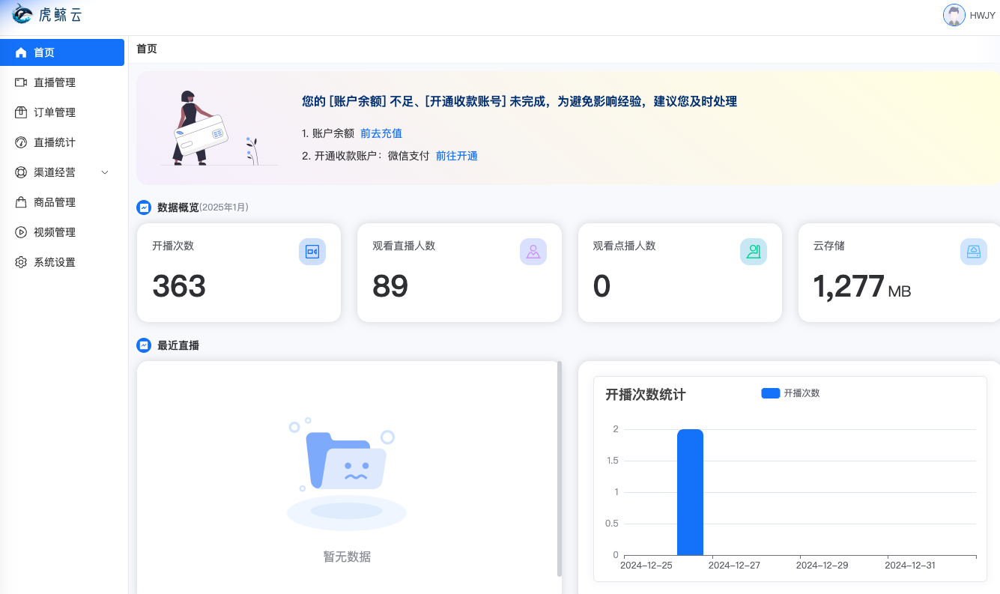
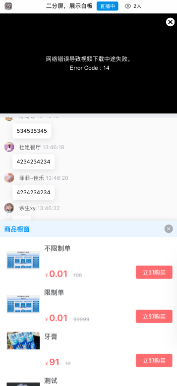
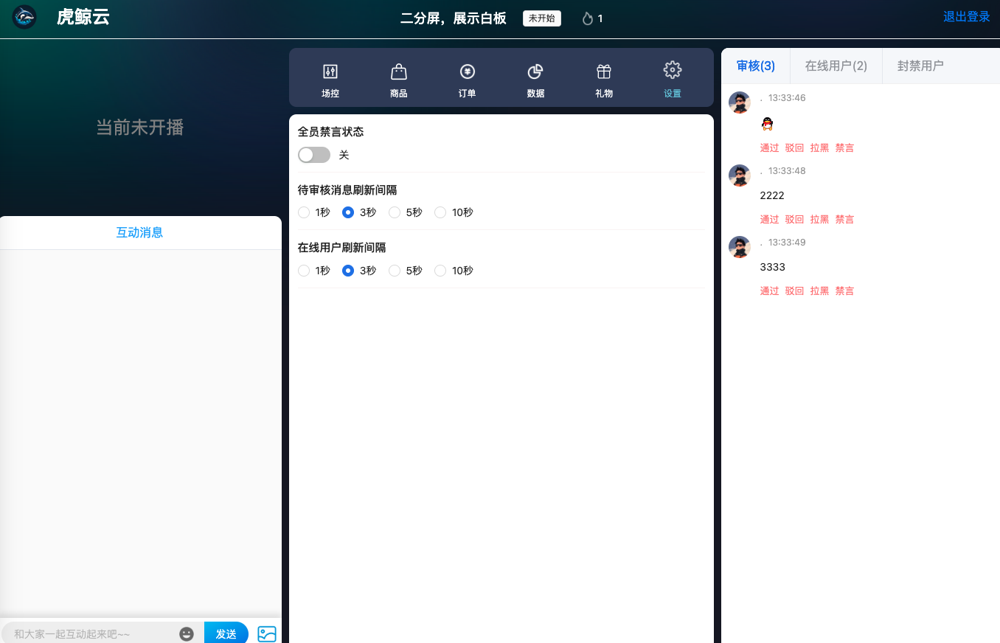

# 虎鲸云 主业务

## AD 欢迎大佬们关注公众号 pinkhello 与 🌍

- 公众号

  

- 个人🌍

  

## 项目介绍

> 专注提供私域直播的开源的SAAS解决方案。

## 项目组成

- [运营管理端](https://github.com/orca-yun/orca-admin)

- [直播助播端](https://github.com/orca-yun/assis-client)(联系+V: pink-hello 索取)

- [直播主播端](https://github.com/orca-yun/anchor-client)(联系+V: pink-hello 索取)

- [直播观看端](https://github.com/orca-yun/audience-client)(联系+V: pink-hello 索取)

- [直播后端服务](https://github.com/orca-yun/living)

- [基础服务-视频直播](联系+V: pink-hello 索取)

- [基础服务-白板服务](联系+V: pink-hello 索取)

- [基础服务-动弹服务](联系+V: pink-hello 索取)

## Demo 地址 [服务器已失效， 需要的请 +v 索取最新的 demo 地址 ]
- 运营端 https://admin.orcacl.com  hwjy/hwjy123
- 助理端 https://admin.orcacl.com/app/assistant
- 主播端 https://admin.orcacl.com/app/anchor
- 观看端 http://d.kfc1.cn/c6e753cef47

# 核心需要修改配置

## SQL文件配置修改

- 短域名链接初始化

- 礼物初始化

- 通联支付初始化

## 数据库的配置修改

- MYSQL 配置【不做赘述】

- MongoDB 配置【不做赘述】

- Redis 配置【不做赘述】

## 配置文件配置修改

- JWT Secret 配置修改

- S3 存储修改
  

- 云直播配置、端到端地址、微信授权修改等等

## ORCA 使用的组件有

- Pulsar 消息中间件
- MySQL 关系型数据库
- MongoDB 非关系型数据库
- Redis 缓存
- Nacos Dubbo注册中心
- Elastic-Job 去中心化任务调度

# [开发指南](./README.DEV.md)

-  [跳转](./README.DEV.md)

# 系统预览

## 运营端

## 观看端

### 观看端H5

### 观看端Web

## 助播端

## 主播端

